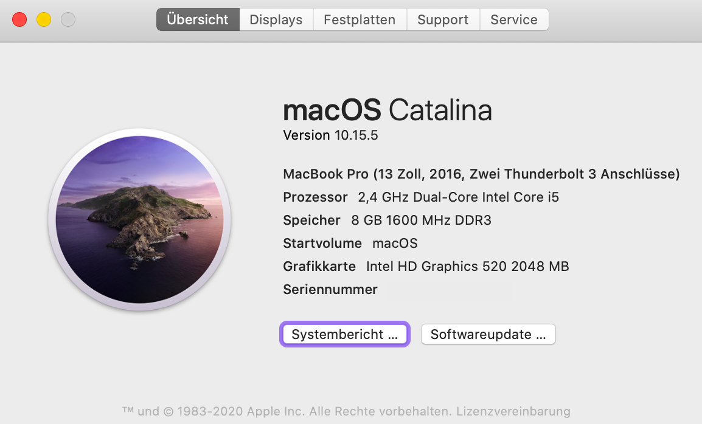
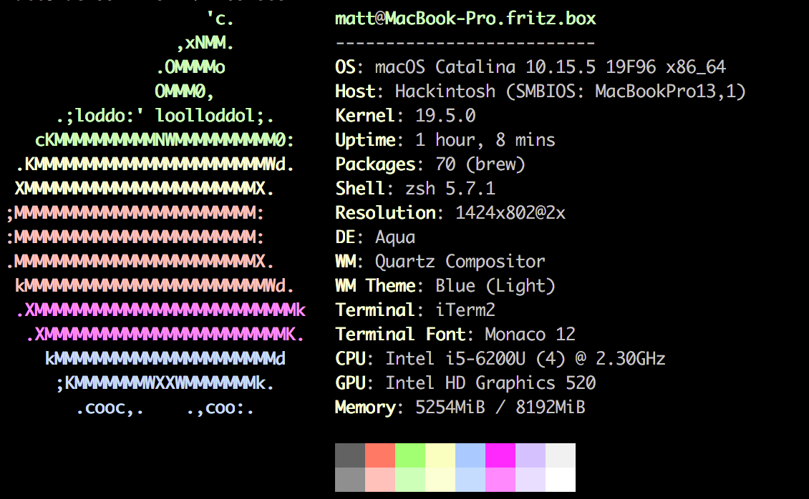

# Lenovo-T460-Hackintosh-Catalina-OpenCore
This repo contains the files and scripts to install macOS on the Lenovo T460 family

sysInfo | neoFetch
:---:|:----:
 | 

# Update History
- [x] macOS 10.15.3
- [x] macOS 10.15.4
- [x] macOS 10.15.4 Supplemental Update

# Laptop's Hardware
- <b>Model</b>: Thinkpad T460 (20FN003LGE)
- <b>Bios</b>: 1.26
- <b>CPU</b>: Intel(R) Core(TM) i5-6200U CPU @ 2.30GHz
- <b>GPU</b>: Intel HD Graphics 520
- <b>Storage</b>: WDC WDS480G2G0A-00JH30 (Upgraded)
- <b>RAM</b>: 8 GB PC3L-12800 1600MHz DDR3L
- <b>Screen</b>: 14" FHD (1920x1080) IPS
- <b>Wi-Fi</b>: Broadcom DW1560 (BCM94352Z) Dual Band M.2 Ngff Wifi Card (Upgraded)
- <b>Ethernet</b>: Intel I219-V PCIe Gigabit Ethernet
- <b>Sound</b>: Realtek ALC3245 (same as ALC239)
- <b>Camera</b>: 720p
- <b>Battery</b>: 3-cell (23Wh) + 3-cell (23Wh)

# Bios settings

<b>Security</b>
- `Security Chip` **Disabled**
- `Memory Protection -> Execution Prevention` **Enabled**
- `Virtualization -> Intel Virtualization Technology` **Enabled**
- `Virtualization -> Intel VT-d Feature` **Enabled**
- `Anti-Theft -> Computrace -> Current Setting` **Disabled**
- `Secure Boot -> Secure Boot` **Disabled**
- `Intel SGX -> Intel SGX Control` **Disabled**
- `Device Guard` **Disabled**

<b>Startup</b>
- `UEFI/Legacy Boot` **UEFI Only**
- `CSM Support` **No**

# What's Working?
- [x] Intel HD 520 Graphics (incuding graphics acceleration)
- [x] CPU Power Management
- [x] Battery
- [x] All USB ports
- [x] HDMI port (including HDMI Audio)
- [x] Intel I219V Ethernet port
- [x] Realtek ALC239 Audio (including headphones jack)
- [x] Wi-Fi & Bluetooth (including Apple services)
- [x] Internal camera (including Facetime)
- [x] Trackpad, Trackpoint and physical buttons (including gestures)
- [x] Sleep / Wake / Shutdown / Reboot (lid sleep and lid wake)
- [x] Keyboard (incuding all fn Keys)
- [x] iMessage, FaceTime, App Store, iTunes Store (with valid smbios)
- [x] DRM support (iTunes Movies, Apple TV+, Amazon Prime and Netflix, and others)

# What's not working ⚠️
- [ ] SD Card Reader (driver in development but incomplete & unstable)
- [ ] Fingerprint Reader (will never work since no drivers available)
- [ ] Sidecar Wireless (doesn't work without apple native WIFI card)
- [ ] Intel WiFi (this <b>must</b> be replaced in order to use WiFi)
